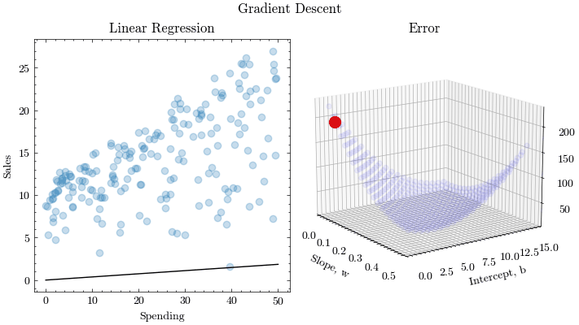

# Gradient Descent

Linear Regression using the Gradient Descent algorithm, NumPy, SymPy, and Matplotlib

## Linear Regression

Gradient Descent is an algorithm that finds the local extrema of a function. This is applicable to machine learning, because we want to find the optimal parameters that minimize our loss function. In machine learning, loss functions quantify the amount of error between the predicted values from a machine learning model and the actual expected values. In this notebook, we will perform linear regression by using gradient descent to find the optimal slope and y-intercept.

Gradient Descent Algorithm Formula
$$X_{n+1} = X_n - lr * \frac{\partial}{\partial X} f(X_n)$$

Linear Regression Formula
$$\hat{y} = w x + b$$

Loss Function
$$MSE = \frac{1}{n} \sum_{i=1}^{n}(y_{i}-\hat{y})^2$$

## Usage

### Running the program

```bash
jupyter notebook
```

### Running via Docker

Build the JupyterLab Docker image and start it

```bash
docker build -t gradient-descent .
docker run --rm -p 8888:8888 -v "$(pwd)":/home/jovyan/work gradient-descent
```

Open JupyterLab at the following URL: [http://127.0.0.1:8888/lab](http://127.0.0.1:8888/lab)

### Running via Docker Compose

Start the Docker image

```bash
docker compose up --build -d
```

Open JupyterLab at the following URL: [http://127.0.0.1:8888/lab](http://127.0.0.1:8888/lab)

Clean up the Docker container

```bash
docker compose down --volumes --rmi local
```

## Program Output


